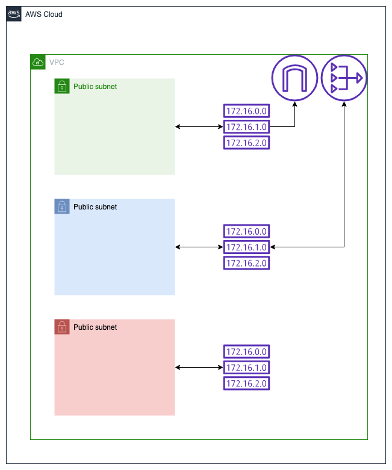

# VPC
Creates the following AWS resources:
1. VPC
2. Subnets (public, private and restricted)
3. NAT gateway
4. Elastic IP to be associated with NAT gateway
5. Routing table for each subnet

Provides networking with minimal AWS resources.

# Resource diagram
