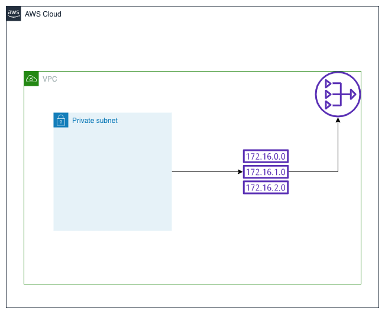

# VPC with private subnet
Creates the following AWS resources:
1. Private subnet
2. Network address translation (NAT) gateway
3. Elastic IP to associate with NAT gateway
4. Route table with public internet access via the NAT gateway

Creates a private subnet within our VPC. This creates a NAT gateway and allows instances within the subnet to connect to the internet, but prevent the internet from initiating a connection with those instances. An elastic IP is associated with the NAT gateway. All traffic inbound and outbound is (0.0.0.0/0) passed through the NAT gateway.

# Resource diagram
