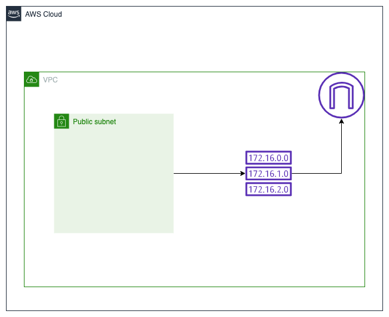

# VPC
Creates the following AWS resources:
1. Public subnet
2. Internet gateway (IGW)
3. Route table with public internet access

Creates a public subnet within our VPC. Importantly adding an internet gateway and linking defaulting all traffic via 0.0.0.0/0 is what allows our subnet to be publicly routable. 

# Resource diagram
