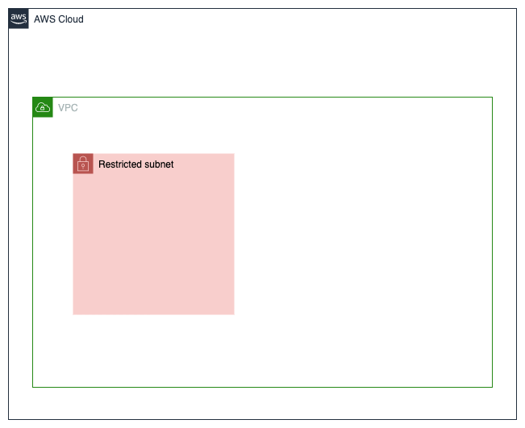

# VPC with restricted subnet
Creates the following AWS resources:
1. Restricted subnet
2. Route table with no additional routes defined

Creates a restricted subnet within our VPC. We still define a route table for this subnet but add no additional routes. This means that only the default route accepting traffic from within the VPC will be added. This is what makes our subnet truly restricted.

# Resource diagram
