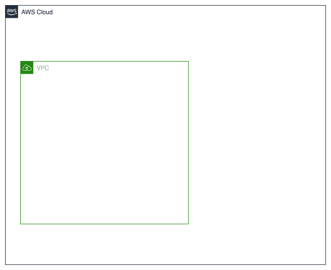

# VPC
Creates the following AWS resources:
1. VPC
2. Internet gateway

The VPC module creates a VPC with an associated internet gateway (IGW). This allows subnets associated with internet gateway to have connectivity to the internet (Subnets with no IGW cannot communicate with the external internet).

# Resource diagram
